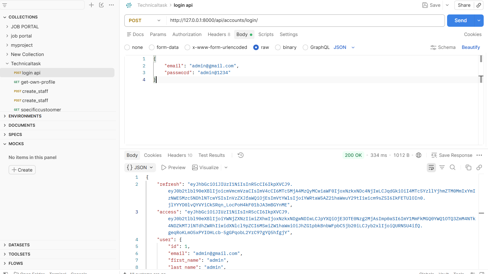
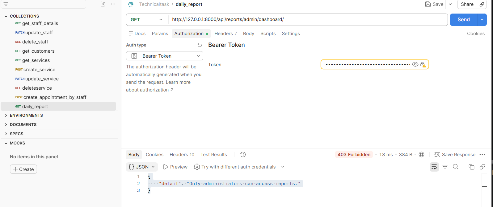
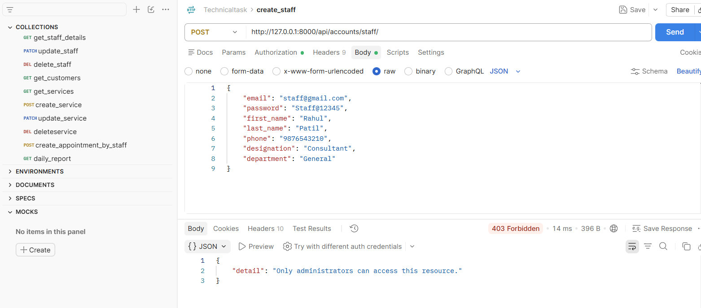
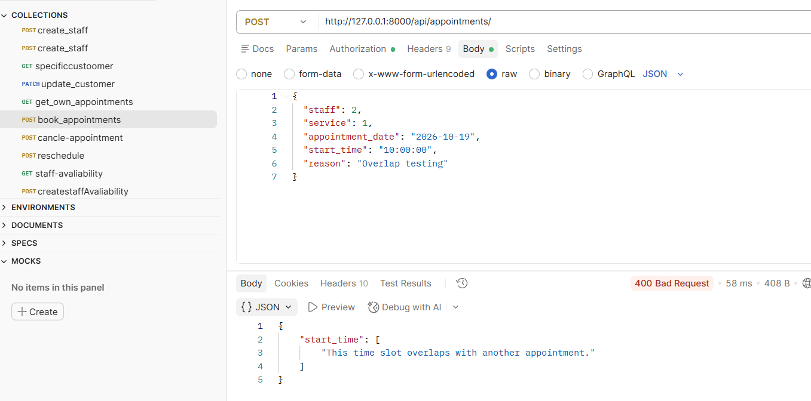
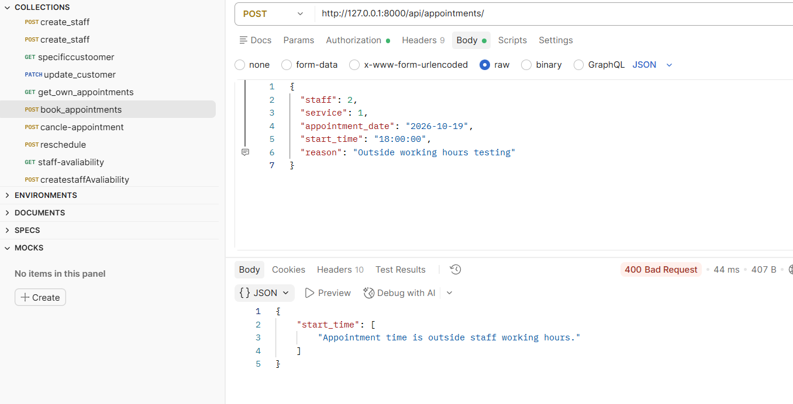
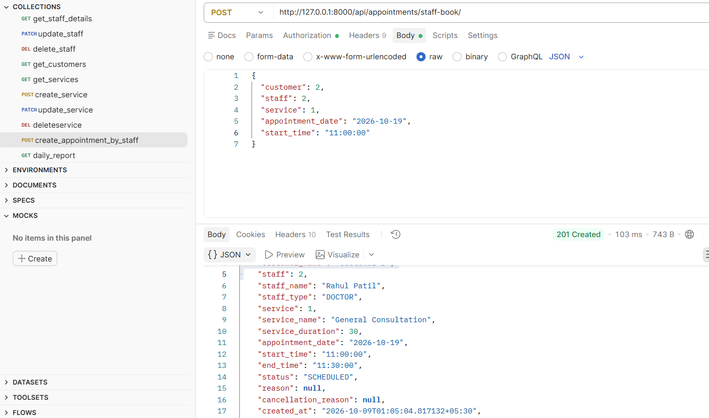
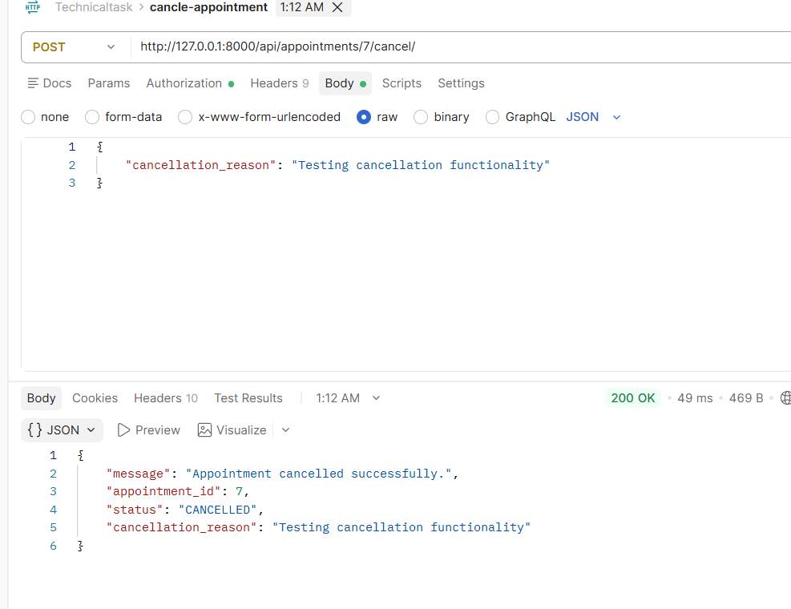
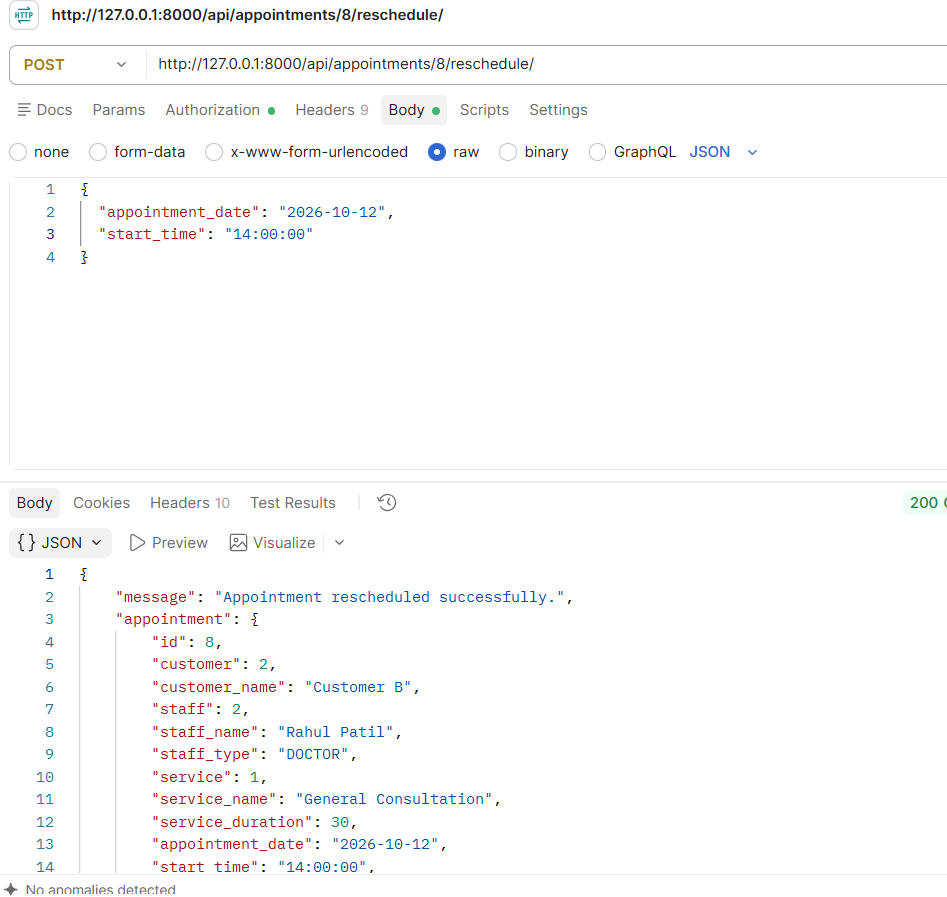
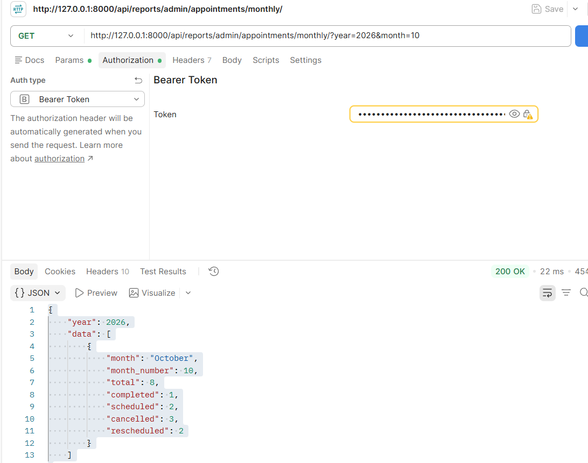
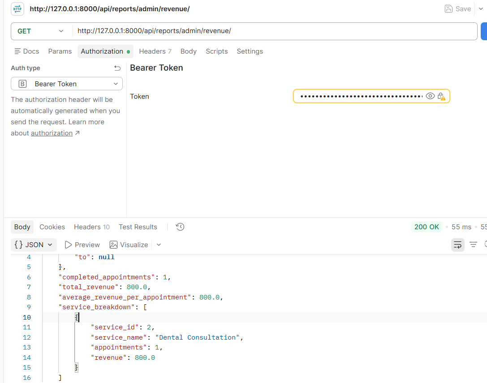

# API Documentation
## Appointment & Booking Management System

**Backend:** Django + Django REST Framework  
**Database:** MySQL  
**Base URL:** `http://127.0.0.1:8000/api/`

---

> **Documentation note:** Endpoint behavior, test results and response examples in this document are based on the current implementation and completed API testing. Postman screenshots are included as evidence placeholders and should be replaced with the actual captured images before submission.

## 1. Overview

This document describes the REST APIs implemented in the Appointment & Booking Management System.

The API is responsible for:

- Authentication and customer registration
- Role-based access control
- Customer management
- Staff management
- Service management
- Recurring staff availability
- Customer appointment booking
- Staff/receptionist appointment booking
- Appointment cancellation
- Appointment rescheduling
- Appointment completion
- Appointment access control
- Administrative reports

Important scheduling rules are enforced in the backend rather than relying only on the frontend.

### User roles

| Role | Description |
|---|---|
| `ADMIN` | Full administrative access and reports |
| `STAFF` | Operational access based on staff type |
| `CUSTOMER` | Customer-facing operations and own appointment/profile access |

Staff types used by the application:

- `DOCTOR`
- `RECEPTIONIST`
- `OTHER STAFF`

---

# 2. Authentication

Protected endpoints require an authenticated user.

The application uses JWT-based authentication.

Use the authentication token returned by the login flow when calling protected APIs, according to the authentication configuration of the running project.

The backend also checks the user's role and, where required, the staff type or object ownership.

A valid login does **not** automatically give access to every endpoint.

---

# 3. API Endpoint Summary

| Method | Endpoint | Purpose |
|---|---|---|
| POST | `/api/accounts/register/` | Register customer |
| POST | `/api/accounts/login/` | Authenticate user |
| GET | `/api/accounts/me/` | Get current authenticated user |
| GET | `/api/accounts/customer/me/` | Get current customer profile |
| PATCH | `/api/accounts/customer/me/` | Update current customer profile |
| GET | `/api/accounts/customers/` | List customers |
| GET | `/api/accounts/customers/{id}/` | Get customer |
| PATCH | `/api/accounts/customers/{id}/` | Update customer |
| GET | `/api/accounts/staff/` | List staff |
| POST | `/api/accounts/staff/` | Create staff |
| PATCH | `/api/accounts/staff/{id}/` | Update staff |
| GET | `/api/services/` | List services |
| GET | `/api/services/{id}/` | Get service |
| POST | `/api/services/` | Create service |
| PATCH | `/api/services/{id}/` | Update service |
| DELETE | `/api/services/{id}/` | Delete service |
| GET | `/api/availability/` | Get staff availability |
| GET | `/api/appointments/` | List appointments |
| GET | `/api/appointments/{id}/` | Get appointment |
| POST | `/api/appointments/` | Create customer appointment |
| POST | `/api/appointments/staff-book/` | Create appointment on behalf of customer |
| POST | `/api/appointments/{id}/cancel/` | Cancel appointment |
| POST | `/api/appointments/{id}/reschedule/` | Reschedule appointment |
| POST | `/api/appointments/{id}/complete/` | Complete appointment |
| GET | `/api/reports/admin/dashboard/` | Dashboard KPIs |
| GET | `/api/reports/admin/appointments/daily/` | Daily appointment report |
| GET | `/api/reports/admin/appointments/monthly/` | Monthly appointment report |
| GET | `/api/reports/admin/appointments/date-range/` | Date-range appointment report |
| GET | `/api/reports/admin/doctors/` | Doctor statistics |
| GET | `/api/reports/admin/services/` | Service statistics |
| GET | `/api/reports/admin/cancellations/` | Cancellation statistics |
| GET | `/api/reports/admin/peak-hours/` | Peak-hour statistics |
| GET | `/api/reports/admin/revenue/` | Revenue statistics |

---

# 4. Account APIs

## 4.1 Customer Registration

### Endpoint

```http
POST /api/accounts/register/
```

### Purpose

Creates a new customer account.

The registration serializer accepts the following fields:

| Field | Type | Description |
|---|---|---|
| `email` | string | Customer email |
| `password` | string | Customer password |
| `first_name` | string | First name |
| `last_name` | string | Last name |
| `phone` | string | Phone number |
| `address` | string | Address |
| `date_of_birth` | date | Date of birth in `YYYY-MM-DD` format |

### Request

```json
{
  "email": "customer12@example.com",
  "password": "Password@123",
  "first_name": "Rahul",
  "last_name": "kadam",
  "phone": "9876543210",
  "address": "Mumbai, Maharashtra",
  "date_of_birth": "2000-05-15"
}
```

### Successful response

**HTTP 201 Created**

```json
{
  "message": "Customer registered successfully.",
  "user": {
    "id": 13,
    "email": "customer12@example.com",
    "first_name": "Rahul",
    "last_name": "kadam",
    "role": "CUSTOMER"
  }
}
```

### Role handling

The client does not submit a role during registration. The backend creates the account with:

```text
CUSTOMER
```

This prevents normal customer registration from being used to create a Staff or Admin account.

---

## 4.2 Login

### Endpoint

```http
POST /api/accounts/login/
```

### Purpose

Authenticates a registered user using email and password.

### Request

```json
{
  "email": "customer@example.com",
  "password": "Password@123"
}
```

### Validation covered during testing

The login flow was tested for:

- Valid credentials
- Unregistered email
- Empty email/password
- Invalid email format
- Incorrect password

The exact successful authentication response is intentionally not reproduced here beyond the verified behavior because the completed test record did not preserve the complete response payload.

---

## 4.3 Current User

### Endpoint

```http
GET /api/accounts/me/
```

### Authentication

Required.

### Purpose

Returns information about the authenticated user.

For a customer, the response includes the associated customer ID.

### Verified response structure

```json
{
  "id": 2,
  "email": "customer@example.com",
  "role": "CUSTOMER",
  "customer_id": 2
}
```

---

# 5. Customer APIs

## 5.1 Get My Customer Profile

```http
GET /api/accounts/customer/me/
```

### Access

Authenticated customer.

### Purpose

Returns the profile associated with the currently logged-in customer.

The profile includes fields such as:

```text
phone
address
```

---

## 5.2 Update My Customer Profile

```http
PATCH /api/accounts/customer/me/
```

### Access

Authenticated customer.

### Request

```json
{
  "phone": "9876543210",
  "address": "Mumbai, Maharashtra"
}
```

### Response

**HTTP 200 OK**

The updated customer profile is returned.

A customer updates their own profile through `/customer/me/`; another customer's ID is not required.

---

## 5.3 List Customers

```http
GET /api/accounts/customers/
```

### Access

Admin.

### Purpose

Returns customer records available to the administrator.

This endpoint was tested successfully using the Admin account.

---

## 5.4 Get Customer by ID

```http
GET /api/accounts/customers/{id}/
```

### Access

Admin.

### Example

```http
GET /api/accounts/customers/1/
```

### Not found

An invalid customer ID such as `999` returns:

```text
404 Not Found
```

with a customer-not-found response.

---

## 5.5 Update Customer by ID

```http
PATCH /api/accounts/customers/{id}/
```

### Access

Admin.

### Example

```http
PATCH /api/accounts/customers/1/
```

### Request

```json
{
  "phone": "9000000001",
  "address": "Mumbai"
}
```

### Response

```text
200 OK
```

The updated customer information is returned.

---

# 6. Staff APIs

Staff accounts are managed separately from customer registration. Normal customers cannot create staff accounts.

## 6.1 List Staff

```http
GET /api/accounts/staff/
```

### Access

Admin or Receptionist.

The implemented view allows GET access for Admin/Receptionist users.

### Example response

```json
{
  "id": 4,
  "name": "Doctor Staff",
  "email": "doctorstaff@gmail.com",
  "first_name": "Doctor",
  "last_name": "Staff",
  "phone": "9321803014",
  "staff_type": "DOCTOR",
  "designation": "Lead Doctor",
  "department": "Dental Consultion",
  "services": [2],
  "is_available": true,
  "is_active": true,
  "role": "STAFF"
}
```

The `services` field contains IDs of services assigned to the staff member.

---

## 6.2 Create Staff

```http
POST /api/accounts/staff/
```

### Access

Admin only.

### Purpose

Creates a Staff user and the corresponding Staff profile.

Supported staff types:

```text
DOCTOR
RECEPTIONIST
OTHER STAFF
```

### Service assignment

Active service IDs can be supplied during staff creation.

The selected services are persisted through the Staff-Service many-to-many relationship.

This was specifically verified after fixing an implementation issue where selected services were initially not being saved.

### Permission behavior

A customer attempting this endpoint receives:

```text
403 Forbidden
```

---

## 6.3 Update Staff

```http
PATCH /api/accounts/staff/{id}/
```

### Access

Administrative staff-management access.

### Example

```http
PATCH /api/accounts/staff/4/
```

### Request

```json
{
  "designation": "Lead Doctor"
}
```

The updated designation was verified through a subsequent GET request.

---

# 7. Service APIs

Services represent the appointment types offered by the system.

## 7.1 List Services

```http
GET /api/services/
```

### Result

```text
200 OK
```

Returns service records available to the application.

---

## 7.2 Get Service

```http
GET /api/services/{id}/
```

### Example

```http
GET /api/services/2/
```

### Result

```text
200 OK
```

---

## 7.3 Get Non-existent Service

```http
GET /api/services/9999/
```

### Result

```text
404 Not Found
```

Verified message:

```text
No Service matches the given query.
```

---

## 7.4 Create Service

```http
POST /api/services/
```

### Example request

```json
{
  "name": "Dental Cleaning",
  "description": "Professional dental cleaning and oral hygiene service",
  "duration": 45,
  "price": 800,
  "is_active": true
}
```

### Result

```text
201 Created
```

The test created Service ID `4`.

---

## 7.5 Update Service

```http
PATCH /api/services/{id}/
```

### Example

```http
PATCH /api/services/4/
```

### Request

```json
{
  "price": 900
}
```

### Result

```text
200 OK
```

The updated price was returned by the API.

Use the trailing slash shown above when calling the endpoint.

---

## 7.6 Delete Service

```http
DELETE /api/services/{id}/
```

### Example

```http
DELETE /api/services/4/
```

### Result

```text
204 No Content
```

---

## 7.7 Service Validation

The following negative validations were tested:

| Validation | Result |
|---|---|
| Negative price | Rejected |
| Negative duration | Rejected |

---

# 8. Availability APIs

Availability represents the recurring weekly working schedule of a staff member.

The current implementation uses recurring weekly availability. It does not provide one-off leave/holiday exceptions.

## 8.1 Get Availability

```http
GET /api/availability/
```

### Example response

```json
{
  "id": 3,
  "staff": 4,
  "staff_name": "Doctor Staff",
  "staff_type": "DOCTOR",
  "day_of_week": 1,
  "day_name": "Tuesday",
  "start_time": "09:00:00",
  "end_time": "17:00:00",
  "is_available": true
}
```

### Availability fields

```text
id
staff
staff_name
staff_type
day_of_week
day_name
start_time
end_time
is_available
```

### Permission test

A customer attempting to create availability was rejected with:

```text
403 Forbidden
```

Availability is used by the appointment validation layer to prevent bookings outside staff working hours.

---

# 9. Appointment APIs

Appointments connect a customer, staff member and service with a date/time.

The backend calculates the appointment end time from the selected service duration.

## Appointment status values

The application uses:

```text
SCHEDULED
COMPLETED
CANCELLED
RESCHEDULED
```

---

## 9.1 List Appointments

```http
GET /api/appointments/
```

### Purpose

Returns appointment records available to the authenticated user according to the implemented access rules.

The endpoint is also used by the application for appointment/history views.

---

## 9.2 Get Appointment

```http
GET /api/appointments/{id}/
```

### Example

```http
GET /api/appointments/9999/
```

### Result for a non-existent appointment

```text
404 Not Found
```

The API was also tested for customer-to-customer appointment isolation. A customer attempting to access another customer's appointment received:

```text
No Appointment matches the given query.
```

The other customer's appointment was not returned.

---

## 9.3 Create Customer Appointment

```http
POST /api/appointments/
```

### Purpose

Creates an appointment for the authenticated customer.

The customer is determined from the authenticated user where applicable.

### Request

```json
{
  "staff": 2,
  "service": 1,
  "appointment_date": "2026-10-19",
  "start_time": "10:00:00"
}
```

The frontend also supports an optional appointment reason where applicable.

The backend calculates `end_time` from the selected service duration.

---

## 9.4 Create Appointment from Staff Side

```http
POST /api/appointments/staff-book/
```

### Access

Authorized staff such as a Receptionist.

### Request

```json
{
  "customer": 2,
  "staff": 2,
  "service": 1,
  "appointment_date": "2026-10-19",
  "start_time": "10:00:00"
}
```

### Verified response

**HTTP 201 Created**

```json
{
  "id": 7,
  "customer": 2,
  "customer_name": "Customer B",
  "staff": 2,
  "staff_name": "Rahul Patil",
  "staff_type": "DOCTOR",
  "service": 1,
  "service_name": "General Consultation",
  "service_duration": 30,
  "appointment_date": "2026-10-19",
  "start_time": "10:00:00",
  "end_time": "10:30:00",
  "status": "SCHEDULED"
}
```

This test also verified automatic end-time calculation.

---


# 9. API Testing and Postman Evidence

The API layer was tested directly using Postman. Testing was not limited to successful requests; negative, validation, business-rule, role-based access and data-isolation scenarios were also checked.

The table below records the API test execution results. It is intended as the quick test summary, while the endpoint sections above document the API contract and the detailed behavior.

## 9.1 API Test Execution Summary

| ID | Module | Logged-in User / Role | API Endpoint | Method | Test Scenario | Expected Result | Actual Result | Status |
|---|---|---|---|---|---|---|---|---|
| AUTH-001 | Authentication | Customer A | `/api/accounts/login/` | POST | Login with valid credentials | `200 OK`, authentication successful | Login successful | ✅ PASS |
| AUTH-002 | Authentication | Customer A | `/api/accounts/login/` | POST | Login with unregistered email | Login rejected | Login rejected | ✅ PASS |
| AUTH-003 | Authentication | Customer A | `/api/accounts/login/` | POST | Login with empty email/password | Validation error | Validation error | ✅ PASS |
| AUTH-004 | Authentication | Customer A | `/api/accounts/login/` | POST | Login with invalid email format | Validation error | Validation error | ✅ PASS |
| AUTH-005 | Authentication | Customer A | `/api/accounts/login/` | POST | Login with incorrect password | Login rejected | Login rejected | ✅ PASS |
| AUTH-006 | Authorization | Customer A | `/api/reports/admin/dashboard/` | GET | Access admin dashboard | `403 Forbidden` | `403 Forbidden` | ✅ PASS |
| AUTH-007 | Authorization | Customer A | `/api/accounts/staff/` | GET | Access staff list | `403 Forbidden` | `403 Forbidden` | ✅ PASS |
| AUTH-008 | Authorization | Customer A | `/api/accounts/staff/` | POST | Create staff | `403 Forbidden` | `403 Forbidden` | ✅ PASS |
| AUTH-009 | Authorization | Customer A | `/api/availability/` | POST | Create availability | `403 Forbidden` | `403 Forbidden` | ✅ PASS |
| AUTH-012 | Authorization | Receptionist | `/api/appointments/{id}/complete/` | POST | Complete appointment | `403 Forbidden` | `403 Forbidden` | ✅ PASS |
| AUTH-013 | Authorization | Doctor | `/api/appointments/{id}/complete/` | POST | Complete another doctor's appointment | Request rejected | Request rejected with assigned-doctor message | ✅ PASS |
| AUTH-015 | Data Isolation | Customer A | `/api/appointments/{id}/` | GET | Access another customer's appointment | Appointment must not be returned | `No Appointment matches the given query.` | ✅ PASS |
| CUST-001 | Customer | Customer A | `/api/accounts/me/` | GET | Get current user | `200 OK` with authenticated user | `200 OK` with customer ID | ✅ PASS |
| CUST-002 | Customer | Customer A | `/api/accounts/customer/me/` | PATCH | Update own profile | `200 OK`, profile updated | `200 OK`, profile updated | ✅ PASS |
| CUST-003 | Customer | Admin | `/api/accounts/customers/` | GET | List customers | `200 OK` | `200 OK` | ✅ PASS |
| CUST-004 | Customer | Admin | `/api/accounts/customers/1/` | GET | Get customer by ID | `200 OK` | `200 OK` | ✅ PASS |
| CUST-005 | Customer | Admin | `/api/accounts/customers/999/` | GET | Get non-existent customer | `404 Not Found` | `404 Not Found` | ✅ PASS |
| CUST-006 | Customer | Admin | `/api/accounts/customers/1/` | PATCH | Update customer | `200 OK`, updated profile | `200 OK`, updated profile | ✅ PASS |
| STAFF-001 | Staff | Admin | `/api/accounts/staff/` | GET | List staff | `200 OK` | `200 OK` | ✅ PASS |
| STAFF-002 | Staff | Admin | `/api/accounts/staff/4/` | PATCH | Update staff designation | `200 OK` | Updated to `Lead Doctor` | ✅ PASS |
| STAFF-003 | Staff | Admin | `/api/accounts/staff/4/` | GET | Verify updated staff data | Updated data returned | `designation: Lead Doctor` and assigned service returned | ✅ PASS |
| SERVICE-001 | Service | Admin | `/api/services/` | GET | List services | `200 OK` | `200 OK` | ✅ PASS |
| SERVICE-002 | Service | Admin | `/api/services/2/` | GET | Get service by ID | `200 OK` | `200 OK` | ✅ PASS |
| SERVICE-003 | Service | Admin | `/api/services/9999/` | GET | Get non-existent service | `404 Not Found` | `404 Not Found` | ✅ PASS |
| SERVICE-004 | Service | Admin | `/api/services/` | POST | Create service | `201 Created` | `201 Created` | ✅ PASS |
| SERVICE-005 | Service | Admin | `/api/services/4/` | PATCH | Update service price | `200 OK` | `200 OK`, price updated | ✅ PASS |
| SERVICE-006 | Service | Admin | `/api/services/4/` | DELETE | Delete service | `204 No Content` | `204 No Content` | ✅ PASS |
| SERVICE-007 | Service Validation | Admin | `/api/services/` | POST | Create service with negative price | Validation error | Request rejected | ✅ PASS |
| SERVICE-008 | Service Validation | Admin | `/api/services/` | POST | Create service with negative duration | Validation error | Request rejected | ✅ PASS |
| AVAIL-001 | Availability | Staff/Admin | `/api/availability/` | GET | Get staff recurring availability | `200 OK` | `200 OK` | ✅ PASS |
| API-001 | Appointment Validation | Customer | `/api/appointments/` | POST | Submit empty appointment body | Required fields rejected | Required fields rejected | ✅ PASS |
| API-002 | Appointment Validation | Customer | `/api/appointments/` | POST | Use invalid staff ID `9999` | Invalid ID rejected | Invalid primary key rejected | ✅ PASS |
| API-003 | Appointment Validation | Customer | `/api/appointments/` | POST | Use invalid service ID `4444` | Invalid ID rejected | Invalid primary key rejected | ✅ PASS |
| API-004 | Appointment Validation | Customer | `/api/appointments/` | POST | Use invalid date format `12-10-2026` | Date format rejected | Date format rejected | ✅ PASS |
| API-005 | Appointment Validation | Customer | `/api/appointments/` | POST | Use invalid time format `2 PM` | Time format rejected | Time format rejected | ✅ PASS |
| API-006 | Appointment Validation | Customer | `/api/appointments/` | POST | Use impossible date `2026-02-30` | Invalid date rejected | Invalid date rejected | ✅ PASS |
| APPT-001 | Appointment | Customer | `/api/appointments/` | POST | Book an appointment in the past | Booking rejected | Past appointment rejected | ✅ PASS |
| APPT-002 | Appointment | Customer | `/api/appointments/` | POST | Book an overlapping slot | Booking rejected | `This time slot overlaps with another appointment.` | ✅ PASS |
| APPT-003 | Appointment | Customer | `/api/appointments/` | POST | Book outside staff working hours | Booking rejected | `Appointment time is outside staff working hours.` | ✅ PASS |
| APPT-004 | Appointment | Customer | `/api/appointments/` | POST | Verify service-duration-based end time | End time calculated from service duration | End time calculated correctly | ✅ PASS |
| APPT-005 | Appointment | Receptionist | `/api/appointments/staff-book/` | POST | Book appointment for a customer | `201 Created` | `201 Created`, appointment ID 7 | ✅ PASS |
| APPT-006 | Appointment | Customer | `/api/appointments/{id}/cancel/` | POST | Cancel valid appointment with reason | Appointment cancelled | Status changed to `CANCELLED` | ✅ PASS |
| APPT-007 | Appointment Validation | Customer | `/api/appointments/{id}/cancel/` | POST | Cancel without reason | Validation error | `This field may not be blank.` | ✅ PASS |
| APPT-008 | Appointment Validation | Customer | `/api/appointments/{id}/cancel/` | POST | Cancel already cancelled appointment | Request rejected | `This appointment cannot be cancelled.` | ✅ PASS |
| APPT-009 | Appointment | Customer | `/api/appointments/{id}/reschedule/` | POST | Reschedule to valid slot | Appointment rescheduled | Status changed to `RESCHEDULED` | ✅ PASS |
| APPT-010 | Appointment Validation | Customer | `/api/appointments/{id}/reschedule/` | POST | Reschedule into overlapping slot | Request rejected | Overlapping slot rejected | ✅ PASS |
| APPT-011 | Appointment Validation | Customer | `/api/appointments/{id}/reschedule/` | POST | Reschedule cancelled appointment | Request rejected | Cancelled appointment rejected | ✅ PASS |
| APPT-012 | Appointment | Admin | `/api/appointments/{id}/complete/` | POST | Complete appointment | Appointment completed | Completion permission/business rule applied | ⚠️ PARTIAL* |
| REPORT-001 | Reports | Admin | `/api/reports/admin/appointments/daily/` | GET | Generate daily report | `200 OK` with grouped daily data | Counts correct; `date` returned `null` | ⚠️ PARTIAL |
| REPORT-002 | Reports | Admin | `/api/reports/admin/appointments/monthly/` | GET | Generate monthly report | `200 OK` | Correct October summary returned | ✅ PASS |
| REPORT-003 | Reports | Admin | `/api/reports/admin/appointments/date-range/` | GET | Generate date-range report | `200 OK` | Correct totals and rates returned | ✅ PASS |
| REPORT-004 | Reports | Admin | `/api/reports/admin/doctors/` | GET | Generate doctor statistics | `200 OK` | Doctor statistics returned correctly | ✅ PASS |
| REPORT-005 | Reports | Admin | `/api/reports/admin/services/` | GET | Generate service statistics | `200 OK` | Service and revenue statistics returned | ✅ PASS |
| REPORT-006 | Reports | Admin | `/api/reports/admin/cancellations/` | GET | Generate cancellation report | `200 OK` | Totals correct; `by_date.date` returned `null` | ⚠️ PARTIAL |
| REPORT-007 | Reports | Admin | `/api/reports/admin/peak-hours/?date=2026-10-12` | GET | Generate peak-hour report | `200 OK` | Peak hours returned correctly | ✅ PASS |
| REPORT-008 | Reports | Admin | `/api/reports/admin/revenue/` | GET | Generate revenue report | `200 OK` | Revenue returned correctly | ✅ PASS |
| REPORT-009 | Reports | Admin | `/api/reports/admin/dashboard/` | GET | Generate dashboard KPI report | `200 OK` | Correct KPI summary returned | ✅ PASS |

\* `APPT-012` is marked partial because the completed test record did not include a positive completion execution using the correct doctor's own assigned appointment. The negative completion/assignment rules were verified.

## 9.2 Types of API Testing Performed

The Postman testing covered the following categories:

| Testing Type | What was checked |
|---|---|
| Positive Testing | Valid login, CRUD operations, appointment booking, cancellation, rescheduling and reports |
| Negative Testing | Invalid credentials, invalid IDs, invalid date/time, invalid service values and invalid appointment actions |
| Validation Testing | Required fields, date/time formats, service price/duration and business-rule validation |
| Authentication Testing | Login and authenticated API access |
| Authorization / RBAC Testing | Customer, Admin, Doctor and Receptionist permissions |
| Data Isolation Testing | Customer attempting to access another customer's appointment |
| Business Rule Testing | Overlap, working hours, past appointments, cancellation and rescheduling rules |
| Date/Time Testing | Past dates, invalid dates, invalid time formats and working-hour boundaries |
| CRUD Testing | Customer, staff and service create/read/update/delete operations where implemented |
| Reporting Testing | Dashboard, daily, monthly, date-range, doctor, service, cancellation, peak-hour and revenue reports |

## 9.3 Postman Test Evidence

The test execution table above records the complete API test results. Postman screenshots should be stored in the repository under:

```text
docs/
└── screenshots/
    ├── api/
    │   ├── AUTH-001-valid-login.png
    │   ├── AUTH-006-report-403.png
    │   ├── AUTH-008-create-staff-403.png
    │   ├── APPT-002-overlap.png
    │   ├── APPT-003-outside-working-hours.png
    │   ├── APPT-005-staff-booking.png
    │   ├── APPT-006-cancel.png
    │   ├── APPT-009-reschedule.png
    │   ├── REPORT-002-monthly.png
    │   └── REPORT-008-revenue.png
```

The following selected screenshots are recommended as evidence because they demonstrate both successful API execution and important negative/security cases.

### AUTH-001 — Valid Login

<!-- Add the actual screenshot file after copying it to docs/screenshots/api/ -->


### AUTH-006 — Customer Accessing Admin Report

<!-- Add the actual screenshot file after copying it to docs/screenshots/api/ -->


### AUTH-008 — Customer Attempting Staff Creation

<!-- Add the actual screenshot file after copying it to docs/screenshots/api/ -->


### APPT-002 — Overlapping Appointment

<!-- Add the actual screenshot file after copying it to docs/screenshots/api/ -->


### APPT-003 — Outside Working Hours

<!-- Add the actual screenshot file after copying it to docs/screenshots/api/ -->


### APPT-005 — Staff/Receptionist Appointment Booking

<!-- Add the actual screenshot file after copying it to docs/screenshots/api/ -->


### APPT-006 — Appointment Cancellation

<!-- Add the actual screenshot file after copying it to docs/screenshots/api/ -->


### APPT-009 — Appointment Rescheduling

<!-- Add the actual screenshot file after copying it to docs/screenshots/api/ -->


### REPORT-002 — Monthly Appointment Report

<!-- Add the actual screenshot file after copying it to docs/screenshots/api/ -->


### REPORT-008 — Revenue Report

<!-- Add the actual screenshot file after copying it to docs/screenshots/api/ -->


> **Postman evidence note:** Replace the image placeholders above with the actual screenshots from the completed Postman runs. Do not create or edit screenshots to make a test appear successful. The screenshot should show the request endpoint, method, response status and relevant response body.


# 11. Appointment Validation Rules

The appointment API performs business validation before saving a booking.

## 10.1 Past date/time

Past appointments are rejected.

Result:

```text
400 Bad Request
```

---

## 10.2 Outside staff working hours

If the requested appointment is outside the staff member's availability:

```text
400 Bad Request
```

Verified message:

```text
Appointment time is outside staff working hours.
```

---

## 10.3 Overlapping appointment

A staff member cannot have two active appointments occupying the same time period.

Result:

```text
400 Bad Request
```

Verified message:

```text
This time slot overlaps with another appointment.
```

---

## 10.4 Service duration

The service duration determines the appointment end time.

Example:

```text
Start time       = 10:00
Service duration = 45 minutes
End time         = 10:45
```

This behavior was verified during testing.

---

## 10.5 Inactive service

An inactive service cannot be used for a new booking.

The appointment validation checks the service state before creating the appointment.

---

# 12. Appointment Cancellation

## 11.1 Cancel Appointment

```http
POST /api/appointments/{id}/cancel/
```

### Request

```json
{
  "cancellation_reason": "Customer requested cancellation"
}
```

### Successful behavior

The appointment status changes to:

```text
CANCELLED
```

---

## 11.2 Cancellation requires a reason

Submitting an empty cancellation reason is rejected.

Result:

```text
400 Bad Request
```

Verified message:

```text
This field may not be blank.
```

---

## 11.3 Cancel already cancelled appointment

An appointment that is already cancelled cannot be cancelled again.

Verified message:

```text
This appointment cannot be cancelled.
```

---

## 11.4 Cancellation timing rule

The appointment cancellation logic also enforces the configured cancellation window. The implemented rule requires cancellation at least one hour before the appointment start time.

---

# 13. Appointment Rescheduling

## 12.1 Reschedule Appointment

```http
POST /api/appointments/{id}/reschedule/
```

### Request

```json
{
  "appointment_date": "2026-10-12",
  "start_time": "13:00:00"
}
```

The backend recalculates the end time from the existing service duration.

A successful reschedule changes the status to:

```text
RESCHEDULED
```

---

## 12.2 Rescheduling validation

The following cases were tested:

- Successful rescheduling
- Rescheduling into an overlapping slot
- Rescheduling a cancelled appointment

An overlapping reschedule is rejected.

A cancelled appointment cannot be rescheduled.

---

# 14. Appointment Completion

## 13.1 Complete Appointment

```http
POST /api/appointments/{id}/complete/
```

### Access

The implemented permission allows:

- Admin
- Doctor

A Receptionist cannot complete an appointment.

### Receptionist result

```text
403 Forbidden
```

Verified message:

```text
Only administrators or doctors can perform this action.
```

### Doctor assignment rule

A Doctor can complete only an appointment assigned to that Doctor.

An attempt to complete another Doctor's appointment was rejected with:

```text
You can complete only your assigned appointments.
```

The negative assigned-doctor permission test passed.

A positive completion test using the correct doctor's own assigned appointment was **not** included in the completed test record, so this document does not claim it as a tested PASS.

---

# 15. Appointment Input Validation

The following negative API tests were completed:

| Test ID | Input | Result |
|---|---|---|
| API-001 | Empty appointment body | Required fields rejected |
| API-002 | Invalid staff ID `9999` | Invalid primary key rejected |
| API-003 | Invalid service ID `4444` | Invalid primary key rejected |
| API-004 | Date `12-10-2026` | Invalid date format rejected |
| API-005 | Time `2 PM` | Invalid time format rejected |
| API-006 | Date `2026-02-30` | Invalid date rejected |

For an empty appointment request, the API identified the missing fields:

```text
staff
service
appointment_date
start_time
```

---

# 16. Reports APIs

All administrative reports are under:

```text
/api/reports/admin/
```

Reports are restricted to Admin users.

A customer attempting to access reports received:

```text
403 Forbidden
```

with:

```text
Only administrators can access reports.
```

---

## 15.1 Dashboard

```http
GET /api/reports/admin/dashboard/
```

### Access

Admin only.

### Verified response

```json
{
  "period": {
    "from": null,
    "to": null
  },
  "kpis": {
    "total_appointments": 7,
    "completed": 1,
    "scheduled": 3,
    "cancelled": 2,
    "rescheduled": 1,
    "completion_rate": 14.29,
    "cancellation_rate": 28.57,
    "total_revenue": 800.0,
    "new_customers": 2
  }
}
```

### Test result

**PASS**

---

## 15.2 Daily Appointment Report

```http
GET /api/reports/admin/appointments/daily/?from=2026-10-01&to=2026-10-31
```

### Verified aggregate result

```text
Total       : 7
Completed   : 1
Scheduled   : 3
Cancelled   : 2
Rescheduled : 1
```

### Current issue

The grouped date value currently returns:

```text
date: null
```

The aggregate counts are correct, but the date grouping field needs correction.

### Status

**PARTIAL / KNOWN ISSUE**

---

## 15.3 Monthly Appointment Report

```http
GET /api/reports/admin/appointments/monthly/?year=2026&month=10
```

### Verified response

```json
{
  "year": 2026,
  "data": [
    {
      "month": "October",
      "month_number": 10,
      "total": 7,
      "completed": 1,
      "scheduled": 3,
      "cancelled": 2,
      "rescheduled": 1
    }
  ]
}
```

### Status

**PASS**

---

## 15.4 Date Range Appointment Report

```http
GET /api/reports/admin/appointments/date-range/?from=2026-10-01&to=2026-10-31
```

### Verified response

```json
{
  "period": {
    "from": "2026-10-01",
    "to": "2026-10-31"
  },
  "total_appointments": 7,
  "completed": 1,
  "scheduled": 3,
  "cancelled": 2,
  "rescheduled": 1,
  "completion_rate": 14.29,
  "cancellation_rate": 28.57
}
```

### Status

**PASS**

---

## 15.5 Doctor Report

```http
GET /api/reports/admin/doctors/
```

### Purpose

Provides appointment statistics grouped by doctor.

### Verified data

```text
Rahul Patil
Total       : 5
Completed   : 0
Scheduled   : 3
Cancelled   : 1
Rescheduled : 1

Doctor Staff
Total       : 2
Completed   : 1
Scheduled   : 0
Cancelled   : 1
Rescheduled : 0
```

### Status

**PASS**

---

## 15.6 Service Report

```http
GET /api/reports/admin/services/
```

### Purpose

Provides appointment and revenue statistics by service.

### Verified data

```text
General Consultation
Appointments : 4
Completed    : 0
Cancelled    : 1
Revenue      : 0

Dental Consultation
Appointments : 2
Completed    : 1
Cancelled    : 1
Revenue      : 800

Follow-up Consultation
Appointments : 1
Completed    : 0
Cancelled    : 0
Revenue      : 0
```

### Status

**PASS**

---

## 15.7 Cancellation Report

```http
GET /api/reports/admin/cancellations/
```

### Purpose

Provides cancellation totals and cancellation statistics.

### Verified result

```text
Total cancelled    : 2
Cancellation rate  : 28.57%
```

Doctor breakdown:

```text
Rahul Patil  : 1
Doctor Staff : 1
```

### Current issue

The date field in the `by_date` section currently returns:

```text
date: null
```

The cancellation totals and doctor breakdown are correct.

### Status

**PARTIAL / KNOWN ISSUE**

---

## 15.8 Peak Hours Report

```http
GET /api/reports/admin/peak-hours/?date=2026-10-12
```

### Required query parameter

```text
date
```

### Verified response

```json
{
  "date": "2026-10-12",
  "peak_hours": [
    {
      "hour": "10:00",
      "appointments": 2
    },
    {
      "hour": "12:00",
      "appointments": 1
    },
    {
      "hour": "13:00",
      "appointments": 1
    }
  ]
}
```

### Missing parameter

A request without `date` returns:

```text
'date' query parameter is required.
```

This is expected validation behavior.

### Status

**PASS**

---

## 15.9 Revenue Report

```http
GET /api/reports/admin/revenue/
```

### Purpose

Calculates revenue based on completed appointments.

### Verified response

```json
{
  "period": {
    "from": null,
    "to": null
  },
  "completed_appointments": 1,
  "total_revenue": 800.0,
  "average_revenue_per_appointment": 800.0,
  "service_breakdown": [
    {
      "service_id": 2,
      "service_name": "Dental Consultation",
      "appointments": 1,
      "revenue": 800.0
    }
  ]
}
```

### Status

**PASS**

---

# 17. Permission and Security Testing

The API was tested directly rather than relying only on frontend button visibility.

| Test | Expected behavior | Result |
|---|---|---|
| Customer → Admin reports | 403 | PASS |
| Customer → Staff GET | 403 | PASS |
| Customer → Staff POST | 403 | PASS |
| Customer → Availability creation | 403 | PASS |
| Receptionist → Complete appointment | 403 | PASS |
| Doctor → Unassigned appointment completion | Rejected | PASS |
| Customer → Another customer's appointment | Not returned | PASS |
| Non-existent appointment | 404 | PASS |

The backend therefore checks more than authentication alone. Depending on the endpoint, it checks role, staff type and/or ownership/assignment.

---

# 18. Role and Permission Summary

The following summary reflects the implemented and tested access rules without treating frontend visibility as a security boundary.

| Operation | Admin | Doctor | Receptionist | Customer |
|---|---|---|---|---|
| Login | Yes | Yes | Yes | Yes |
| Customer registration | Registration flow available | No | No | Yes |
| View own profile | Yes | Yes | Yes | Yes |
| Customer management | Yes | Restricted by implementation | Restricted by implementation | Own profile |
| List staff | Yes | No/according to endpoint | Yes | No |
| Create staff | Yes | No | No | No |
| Update staff | Admin management | No | No | No |
| Service management | Yes | Endpoint-specific | Endpoint-specific | No |
| View availability | Yes | Endpoint-specific | Endpoint-specific | Endpoint-specific |
| Create appointment | Yes | Yes | Yes | Yes |
| Staff booking | Authorized staff | Authorized staff | Authorized staff | No |
| Cancel appointment | According to implemented permission | According to implemented permission | According to implemented permission | Own appointment |
| Reschedule appointment | According to implemented permission | According to implemented permission | According to implemented permission | Own appointment |
| Complete appointment | Yes | Assigned appointment only | No | No |
| Admin reports | Yes | No | No | No |

The exact backend permission classes remain the source of truth for access control.

---

# 19. Core Business Rules Enforced by the API

### Booking

- Past date/time is rejected.
- Staff availability is checked.
- Appointment must fall inside working hours.
- Overlapping appointments are rejected.
- Service duration determines appointment end time.
- Invalid staff/service IDs are rejected.
- Invalid date/time formats are rejected.
- Inactive services cannot be booked.

### Cancellation

- Cancellation requires a reason.
- Already cancelled appointments cannot be cancelled again.
- Cancellation timing rules are enforced.

### Rescheduling

- New date/time is validated.
- New slot must satisfy staff availability and working hours.
- Overlapping rescheduling is rejected.
- Cancelled appointments cannot be rescheduled.
- Successful rescheduling changes the status to `RESCHEDULED`.

### Completion

- Receptionists cannot complete appointments.
- Doctors cannot complete appointments assigned to another doctor.
- Admins can complete appointments according to the implemented permission.

### Security

- Customers cannot create staff.
- Customers cannot access admin reports.
- Customers cannot create availability.
- Customer appointment access is isolated.
- Backend permissions are enforced independently of frontend controls.

---

# 20. Issues Found and Fixed During Development

## 19.1 Staff service assignment

### Problem

The Add Staff form allowed services to be selected, but the selected service IDs were initially not being saved to the Staff-Service many-to-many relationship.

### Fix

The Staff serializer was updated to accept active service IDs and save the many-to-many relationship.

### Verification

Staff ID `4` returned:

```json
{
  "services": [2]
}
```

### Status

**FIXED**

---

## 19.2 Staff POST permission error

### Problem

The StaffCreateView initially had incorrect permission handling for POST requests. A customer request resulted in a server error instead of a normal permission response.

### Fix

Permission handling was corrected so that:

```text
GET  → Admin / Receptionist
POST → Admin only
```

### Verification

Customer attempting:

```http
POST /api/accounts/staff/
```

now receives:

```text
403 Forbidden
```

### Status

**FIXED**

---

## 19.3 Daily report date field

### Problem

The daily appointment report returns correct aggregate counts, but the grouped date value is currently `null`.

### Status

**KNOWN ISSUE**

---

## 19.4 Cancellation report date field

### Problem

The cancellation report returns correct totals and doctor statistics, but `by_date.date` currently returns `null`.

### Status

**KNOWN ISSUE**

---

# 21. Testing Notes

Some failed requests during testing were caused by incorrect request formatting rather than application defects.

For example, the Service PATCH endpoint expects the trailing slash:

```http
PATCH /api/services/4/
```

A request sent without the expected slash was treated as URL/method handling behavior and was not counted as an API implementation defect.

Similarly, the Peak Hours report requires a `date` query parameter. Calling it without that parameter is treated as request validation rather than an application failure.

---

# 22. API Error Status Codes

The following HTTP statuses were observed during testing:

| Status | Usage |
|---|---|
| `200 OK` | Successful GET/PATCH |
| `201 Created` | Successful resource creation |
| `204 No Content` | Successful deletion |
| `400 Bad Request` | Validation or business-rule failure |
| `403 Forbidden` | Authenticated user lacks permission |
| `404 Not Found` | Resource does not exist or is not accessible |

Examples:

```text
Invalid appointment data      → 400
Past appointment             → 400
Overlapping appointment       → 400
Outside working hours         → 400
Customer → reports            → 403
Customer → create staff       → 403
Receptionist → complete       → 403
Invalid appointment ID        → 404
Invalid service ID             → 404
```

---

# 23. API Design Approach

The API uses resource-oriented routes for normal CRUD operations:

```text
/api/accounts/customers/
/api/accounts/staff/
/api/services/
/api/availability/
/api/appointments/
```

Business actions that represent a state transition use dedicated action routes:

```text
/api/appointments/staff-book/
/api/appointments/{id}/cancel/
/api/appointments/{id}/reschedule/
/api/appointments/{id}/complete/
```

Administrative reporting is grouped under:

```text
/api/reports/admin/
```

This keeps normal resources separate from appointment state transitions and administrative reporting.

---

# 24. Backend Security Model

The API does not treat frontend restrictions as security.

For protected operations, the backend follows the general decision flow:

```text
Authenticated user
       ↓
User role
       ↓
Staff type, where required
       ↓
Ownership / assignment, where required
       ↓
Business validation
       ↓
Database operation
```

This is particularly important for:

- Customer data isolation
- Staff management
- Appointment completion
- Appointment ownership
- Admin reports
- Availability management
- Appointment scheduling rules

---

# 25. Testing Coverage

The API testing completed for this assignment covered:

### Authentication

- Valid login
- Invalid login
- Missing credentials
- Invalid email
- Incorrect password

### Customer Management

- Current user
- Own customer profile
- Customer list
- Customer detail
- Customer update
- Invalid customer

### Staff Management

- Staff creation
- Staff listing
- Staff update
- Staff type
- Service assignment
- Permission restrictions

### Services

- List
- Detail
- Create
- Update
- Delete
- Invalid service
- Negative price
- Negative duration

### Availability

- Staff availability
- Working hours
- Customer permission restriction

### Appointments

- Customer booking
- Staff booking
- Past date/time
- Overlap
- Working hours
- Service duration
- Cancellation
- Cancellation validation
- Rescheduling
- Rescheduling overlap
- Cancelled appointment
- Completion permissions
- Appointment isolation

### Reports

- Dashboard
- Daily
- Monthly
- Date range
- Doctors
- Services
- Cancellations
- Peak hours
- Revenue

### Security

- Customer → Admin endpoints
- Customer → Staff endpoints
- Customer → Availability creation
- Customer → Other customer data
- Receptionist → Completion
- Doctor → Unassigned appointment completion

---

# 26. Known Limitations

The following items are intentionally documented rather than hidden.

## 25.1 Daily report date grouping

The daily report currently returns `date: null` in its grouped data, although aggregate counts are correct.

## 25.2 Cancellation report date grouping

The cancellation report currently returns `by_date.date: null`, although cancellation totals and doctor breakdown are correct.

## 25.3 Recurring availability only

Availability is currently based on recurring weekly schedules.

One-off staff leave, holidays or date-specific availability exceptions are not implemented.

---

# 27. Final API Status

The API layer covers the main assignment requirements:

```text
Authentication
      +
Role-based access
      +
Customer management
      +
Staff management
      +
Service management
      +
Availability
      +
Appointment booking
      +
Cancellation
      +
Rescheduling
      +
Completion
      +
Appointment validation
      +
Appointment access control
      +
Administrative reports
```

The API was tested with positive, negative, validation, date/time, business-rule and permission/security scenarios.

Most tested functionality is working as expected. The remaining known issues are limited to the date grouping fields in the daily appointment and cancellation reports, plus the documented limitation that staff availability is recurring rather than leave/holiday aware.
